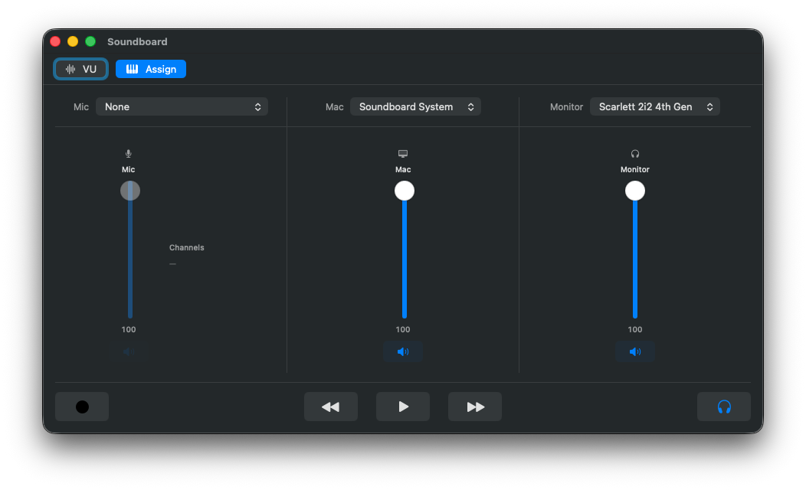
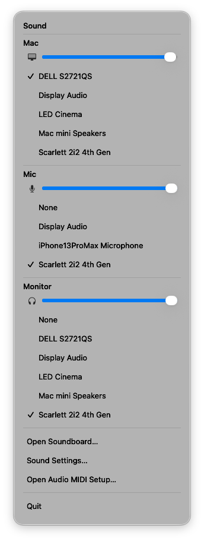

# Soundboard

> [!IMPORTANT]
> **🤖 This entire project was written by Claude — Anthropic's Claude Opus 4.8 —
> working in Claude Code.** Every line of source, the build system, the docs, and
> this README were authored by the model under human direction. Keep that in mind
> when reading, reusing, or auditing the code.

## Why?

- **Real knobs.** Plug in a MIDI controller (faders, pads — e.g. an AKAI MPD218)
  and you get a physical remote for your sound: ride your mic level, balance it
  against your desktop audio, mute either one instantly — without alt-tabbing or
  digging through menus.
- **Be heard.** Bring your computer's audio into a call when you present.
  Sharing a demo, a tutorial, or a video clip and want people to actually *hear*
  it, not just see it? Soundboard blends your mic and your desktop audio and
  feeds the mix into the meeting as a normal microphone.

It's the audio mixing console I reach for every day: full, hands-on control of
what I hear and what everyone on the call hears, straight from the hardware.

A software + hardware audio mixing console for macOS. A physical MIDI control
surface (faders/buttons) drives a live mix: the app captures your microphone and
everything your Mac plays, blends them in software, and feeds the result to a
from-scratch virtual **loopback** device (so any app/recorder can pick up the mix),
to an optional **monitor** output (so you can hear it), and to an optional **`.wav`
recording**. Transport keys (Play/Pause, Next, Prev) and every fader/mute are
MIDI-assignable.

Everything here is written from scratch — no forks of BlackHole, deej, etc.

| Console | Menu bar |
|---------|----------|
|  |  |

## Install

1. Download the latest `Soundboard-x.y.pkg` from the
   [**Releases**](https://github.com/BorisVanin/soundboard/releases) page.
2. Double-click it and follow the installer (it installs `Soundboard.app` to
   `/Applications` and the loopback driver into the system, then restarts the audio
   daemon so the virtual device appears immediately).
3. Launch Soundboard. On first run it requests **microphone**, **system-audio
   capture**, and (optionally) **accessibility** permissions — these are required to
   capture sources and post media keys.

## Build

Requires Xcode, [mise](https://mise.jdx.dev), and your Apple Developer Team ID.
The driver loads inside `coreaudiod`, so it must be code-signed.

```sh
brew install mise
mise run templates         # vendor the xcodegen-templates into ./xcodegen-templates
cp .envrc.default .envrc   # set DEVELOPMENT_TEAM (your Apple Developer Team ID)
make                       # generate every module's project + the workspace
make open                  # open Soundboard.xcworkspace in Xcode
make test                  # run the shared-memory ring + protocol unit tests
make pkg                   # build a signed, notarized .pkg into dist/
```

Full setup (direnv, signing identities, every `make` target) is in
[docs/building.md](docs/building.md).

## Documentation

- [**Architecture**](docs/architecture.md) — how capture → mix → loopback/monitor/record
  works, the modules, control flow, and the macOS constraints behind the design.
- [**Building**](docs/building.md) — toolchain, Team ID, signing identities, `make` targets.
- [**Releasing**](docs/releasing.md) — building, notarizing, and publishing a signed `.pkg`.
- [**Protocol**](docs/protocol.md) and [**SHMEM**](docs/shmem.md) — the
  driver↔app HAL protocol and the shared-memory ring contract.
- [**Zipper-noise fix**](docs/zipper-noise.md) — the per-sample fader gain smoothing
  and the signal theory behind it.
- [**Contributing**](docs/contributing.md) — how to get a clean build and submit changes.

## License

Licensed under the [Apache License 2.0](LICENSE). © 2026 Boris Vanin.

The code in this repository was written by Anthropic's **Claude Opus 4.8** via
Claude Code, under human direction.
